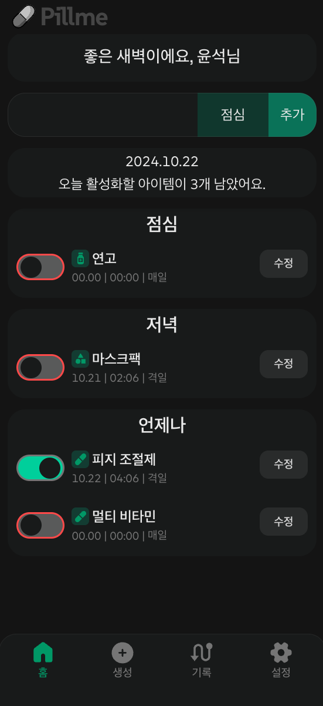

# Pillme

사람들이 그 날 먹을 약을 복용or사용 했는지 헷갈리는 경우가 자주 있다는 것을 깨달았습니다. '어떻게 하면 헷갈리지 않을 수 있을까?'를 생각하다가 본 서비스를 만들게 되었습니다. 시간대에 맞게 약을 추가할 수 있고, 해당 약을 사용or복용 시 그 아이템를 클릭 하면 활성화되고 클릭한 날짜 및 시간이 저장되게 됩니다. 그리고 활성화된 아이템들은 자신의 빈도에 맞춰 leftDay에 1에서 날짜가 넘어가는 00시에 비활성화 됩니다.

> 링크 : https://take-medicine.vercel.app/

## Tech Stack

Next.js, TypeScript, Emotion, Zustand, PWA

## Introduce

- 상단 인풋 혹은 생성 페이지에서 이름과 시간대, 빈도 및 종류를 선택하고 추가 시 하단에 아이템이 추가가 됩니다.
- 아이템 좌측의 토글버튼을 클릭으로 활성화를 할 수 있고 클릭 시 날짜 및 현재시각이 기록됩니다.

  
